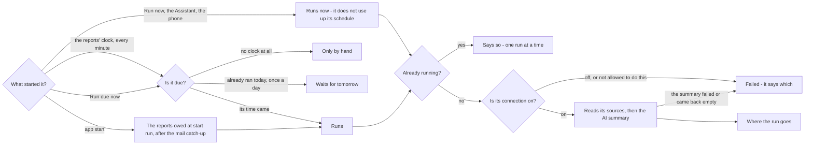
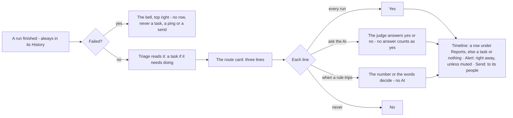

# How a report runs, and where a run goes

Decided with the owner on 2026-09-27 (C1-C6 on the Reports and Advisor decision map): one road for running a report,
one card for where a run goes, and a failure that stays in the app. Revised 2026-09-28: the work line is gone -
triage reads every run that worked - and a failure is the bell's alone. The site shows both trees on the Reports page;
`website/tools/render-diagrams.mjs` draws them from the blocks below.

## When a report runs

| Door | What it does |
|---|---|
| App start | The reports set to run on app start, after the mail catch-up - even when the catch-up is off |
| The reports' clock | Every minute, whatever is due. It is not the mail's clock: turning the mail poll off leaves reports running |
| Run due now | Everything owed, and nothing else - not a mail sync |
| Run now, the Assistant's `report.run`, the phone | Runs at once. A manual run is extra: it does not use up "once a day" or move the next slot |
| A scheduled run, worked or failed | Moves the report's clock. A failure is tried again at its next slot, never in between |
| A second door while it runs | Told it is already running |
| A switched-off connection | The run fails and says to turn it on under Connections |

## Where a run goes

| Line | every run | ask the AI | when a rule trips | never |
|---|---|---|---|---|
| **Timeline** | A row under Reports, every run | A row when the judge says your sentence holds | A row when the rule trips | No row: a task, or nothing |
| **Alert** | Reaches you right away on your channel, no Review | When the judge says so | When the rule trips | Never |
| **Send** | Out to its people, through Review unless set to send without asking | When the judge says so | When the rule trips | Never |

| Rule | Trips when |
|---|---|
| anything came back | at least one row, or the headline's number is above 0 |
| nothing came back | no rows |
| fewer than N / more than N | the headline's number (rows, or a total a finance report leads with) |
| it mentions / it never mentions | the words, anywhere in the result |

- **Triage reads every run that worked**, whatever the card says, under `TRIAGE.md` and the report's own brief
  ("Make it a task when…", `watch_for`). A task if it needs doing; otherwise the Timeline line decides whether it
  shows under Reports.
- **A failure** is in the bell, top right, and nowhere else: no row, never a task, never an alert, never sent to
  anyone. The bell reads each report's latest run, so it clears itself when a run works again. An Advisor whose model
  fails has failed the same way.
- **One source of several failing** is not a failed run: the other sources are read, filed and sent as usual, and
  the bell says which source the run went without.
- **A send or an alert that did not go** is in the bell too, never on the rail: the latest one per report, until
  one goes.
- **No schedule** means the report runs only when you press Run now; its row on the Reports page has a red border
  that says so.
- **A mute** covers the alert and the morning brief as well as the rail.
- **Reports saved before the card** were converted once, meaning exactly what they did: `reach` and the alert's
  condition became the Timeline and alert lines, "only when something is wrong" became an AI line with that
  sentence, and an alert on failure became never. A work line's sentence became the report's triage brief.
- **The Advisor** is on the same card. With nothing set it asks the AI on the Timeline line whether an idea
  matters - one watching systems too, so a run that found nothing posts nothing. Every idea is triaged; with the
  Timeline at no, an idea that became no task is put down. Its alert and send lines work like any report's.
