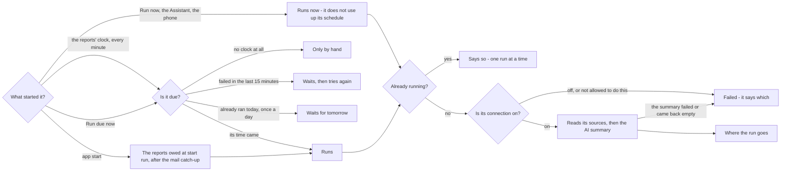
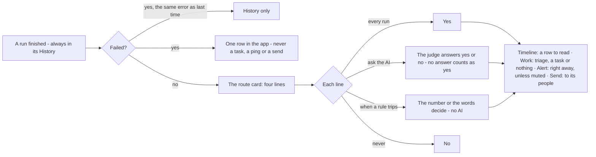

# How a report runs, and where a run goes

Decided with the owner on 2026-09-27 (C1-C6 on the Reports and Advisor decision map): one road for running a report,
one card for where a run goes, and a failure that stays in the app. The site shows both trees on the Reports page;
`website/tools/render-diagrams.mjs` draws them from the blocks below.

## When a report runs

| Door | What it does |
|---|---|
| App start | The reports set to run on app start, after the mail catch-up - even when the catch-up is off |
| The reports' clock | Every minute, whatever is due. It is not the mail's clock: turning the mail poll off leaves reports running |
| Run due now | Everything owed, and nothing else - not a mail sync |
| Run now, the Assistant's `report.run`, the phone | Runs at once. A manual run is extra: it does not use up "once a day" or move the next slot |
| A scheduled run that worked | Moves the report's clock |
| A scheduled run that failed | Tried again 15 minutes later, not tomorrow |
| A second door while it runs | Told it is already running |
| A switched-off connection | The run fails and says to turn it on under Connections |

## Where a run goes

| Line | every run | ask the AI | when a rule trips | never |
|---|---|---|---|---|
| **Timeline** | A row to read, every run | A row when the judge says your sentence holds | A row when the rule trips | No row. With work on, only a task |
| **Work** | Triage reads it; a task if `TRIAGE.md` says so | Triage, when the judge says so | Triage, when the rule trips | Never a task |
| **Alert** | Reaches you right away on your channel, no Review | When the judge says so | When the rule trips | Never |
| **Send** | Out to its people, through Review unless set to send without asking | When the judge says so | When the rule trips | Never |

| Rule | Trips when |
|---|---|
| anything came back | at least one row, or the headline's number is above 0 |
| nothing came back | no rows |
| fewer than N / more than N | the headline's number (rows, or a total a finance report leads with) |
| it mentions / it never mentions | the words, anywhere in the result |

- **A failure** reaches you once, in the app: one row, never a task, never an alert, never sent to anyone. The same
  error again stays in the History, recorded as a failure.
- **A mute** covers the alert and the morning brief as well as the rail.
- **Reports saved before the card** were converted once, meaning exactly what they did: `reach` and the alert's
  condition became the Timeline and alert lines, the `triage` switch became the work line, "only when something is
  wrong" became an AI line with that sentence, and an alert on failure became never.
- **The Advisor** is on the same card. With nothing set it asks the AI on the Timeline and work lines whether an idea
  matters; its alert and send lines work like any report's.
