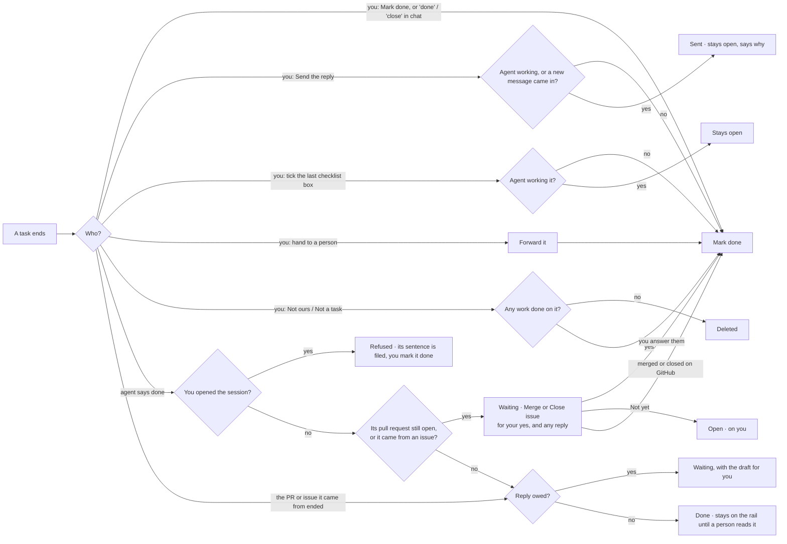

# How a task ends

Every way a task can end, and exactly what happens. If you are about to add a button, an
Assistant verb or an automation that finishes a task, it goes through one of the roads below.
Do not add a new one.

Decided with the owner on 2026-09-24, after a trace found about fifteen separate places that
closed a task. Each did its own part of the clean-up, so the same "it didn't close" and "a
closed task still shows" bugs kept coming back.

## The one close: Mark done

There is one close, `concierge.close_task`, and one word for it everywhere: **Mark done**. It
always does all five of these:

1. the task's status becomes `done`
2. any draft waiting for your yes is retired (it stays on the task, unsent)
3. a live agent session on the task is stopped
4. the item leaves the work rail
5. the "yours to end" mark comes off (see below)

## Decision tree

## The doors

| You do | What happens | Code |
|---|---|---|
| **Mark done**: the task page, the Assistant's button or card, "done" or "close" typed or said in chat, the phone | Mark done | `concierge.close_task`; `server` operations `task.complete` and `item.settle`; the task `PATCH` |
| **Send the reply** | Sends, then Mark done. It stays open (with a comment saying why) while an agent is actively working it, or if a new message arrived on the task after the one you answered. | `verdicts._settle_task_after_sent_reply` |
| **Tick the last checklist box** | Mark done, unless an agent is actively working it | `server.tick_checklist` |
| **Hand to a person** | Forwards, then Mark done | `server` hand-off endpoint |
| **Not ours / Not a task** | Deleted when nothing was done on it; otherwise Mark done | `server._file_task` |
| **Close without sending** (a channel that can't send) | Mark done | `verdicts.decide` (`close_unsent`) |

| An agent does | What happens | Code |
|---|---|---|
| Says it is done (`taskuary --done`) | The session is written up. If its work is an open pull request, or the task came from a GitHub issue, the task **waits** for its close-out (below). If a reply is owed, it **waits** with the draft too. Otherwise it is done. On a task marked `stay:open` it is refused: the agent's sentence is filed as a comment and you mark it done. | `selfclose.declare` → `coder.wrap` → `coder.finish` |
| The pull request or issue the task **came from** is merged or closed | Same as above, with no reply and no close-out owed | `channels.close_upstream_ended` |

## The close-out

What finishes a task depends on where it lives. Mail is finished by the reply. A pull request the agent opened
is finished by merging it, and an issue by closing it. So the finish raises that last act as a card waiting for
your yes, and the task is not done until you answer it (decided with the owner on 2026-09-27).

| The task's work is | The card | Its text | Your yes does | Code |
|---|---|---|---|---|
| A pull request the agent opened, still open | **Merge** | the agent's summary - the squash message | marks the draft ready, squash-merges it (refused while its checks are red, or if the branch moved after the card was raised), then Mark done | `proposals` `merge_pr` → `github.merge_pr` |
| A pull request the task came from (a contributor's PR the agent reviewed), still open | **Merge** | empty - GitHub writes the merge message | the same | the same |
| An issue the task came from | **Close issue** | the closing comment (empty when a reply carries it) | comments, closes the issue, then Mark done | `proposals` `close_issue` |

- **Close PR** (beside Merge) closes the pull request on GitHub without merging it, then Mark done - the work was
  not wanted. **Not yet** keeps the task open and on you. Merging or closing the pull request on GitHub yourself answers it
  the same way: the card is retired and the task closes (`ci.pr_ended`).
- With a reply owed as well, both wait. The merge comes first, so the reply can say it is merged; the comment
  comes before an issue closes. Sending the reply does not close the task while its close-out waits.
- The words are drafted like any reply; the act is plain code on your click. No agent has to still be running.
- **Mark done** is still the one close. Pressing it yourself skips the close-out, and the pull request stays
  open on GitHub.
- The PR body carries `Closes #N` when the task came from an issue in the same repository, so the merge
  closes the issue as well.
- A close-out is **your** act, so it needs no agent switch: **Agents may push / deploy** and **use as tracker**
  gate what an agent may ask for, not what you press. Only Taskuary raises one - an agent that writes the
  close-out mark into its own proposal has it stripped (`proposals.parse`). It needs the GitHub token.
- A task an agent finished before the close-out existed is offered it on the next sync, once
  (`proposals.backfill`); after **Not yet** it is not asked again.
- Your own merge does not swallow an unsent reply: when the pull request the task came from closes because you
  merged it, a reply still waiting keeps the task open until you send it (`channels.close_upstream_ended`).

## Rules that follow from this

- **Never seen by a person stays on the work rail.** A task an agent or a merged PR closed stays
  on the rail, however long ago, until someone reads it (`processing_unread._agent_finished`).
  Agents may open and close tasks; they may not make one silently disappear.
- **A quiet screen is not an ending.** There is no longer a judge that reads a stopped session
  and guesses it finished; the Stop hook is an observation and closes nothing. Only the agent saying
  so, or you, ends a task.
- **"Yours to end".** When you start or continue a session on a task yourself, the task is quietly
  marked `stay:open`. It is one rule: an agent may close its own task only when the task allows it.
  With the mark on, `taskuary --done` is refused (`selfclose.declare`), and the agent's seed says
  exactly that. None of your own actions look at the mark, and Mark done removes it.
- **One setting, on or off.** `agent_self_close` used to offer "auto" and "only when it says so";
  they differed only by the quiet-screen judge, so they are one now. An old `ask` reads as on.

## Not endings

These never close a task:

- **Save and end session**: stops the agent and writes its report; the task stays open.
- **Reject** a draft: the draft is rejected; the task is untouched.
- **Next**: it moves the walk; open work comes back after `task_return_minutes`.
- **Remind me**: the task is put away until a day (`remind.py`), then back on the rail that morning.

## Removed

These existed until 0.3.6.9 and were taken out because they closed tasks behind every other rule:

- dragging a card between Board columns
- the Wall's "Wrap up task" button
- the "No reply needed" button (Mark done is that)
- the quiet-screen judge
- the labels "Close the task", "Close without sending" and "Mark task done" (all Mark done now)
