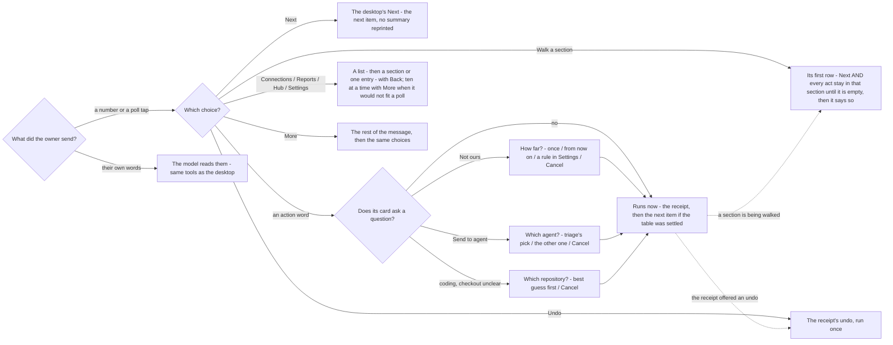

# The phone's choices

The owner, 2026-09-25: the phone Assistant matches the desktop Assistant exactly; the only differences are
formatting that reads well in WhatsApp, and buttons to tap. On WhatsApp the choices arrive as a poll under
the message; on Telegram as the bot's own buttons under it (2026-09-29 - no poll needed there). A typed number
still answers on both, and only the newest message's choices run: a tap on an older one is answered, never run.

## What a pick does

A number, or a tap in the poll, is the desktop's button. It runs in code on the same road the button uses
(`concierge.propose_direct`, `run_proposal`, `surface`). The model never reads it. Only words the owner
types go to the model.

## The rules

| # | Rule | Why |
|---|---|---|
| 1 | A pick runs the desktop's action in code; the model reads only typed words | a pick used to go to the interpreter as words and could come back as a different verb |
| 2 | A card's own question is asked as numbered choices, and nothing runs until it is answered | the phone skipped "how far?" and ran Not ours as just-this-once, and guessed the agent and the checkout |
| 3 | The choice that was already the answer is the confirm; another answer runs at once | one tap, not a second "yes, go ahead" |
| 4 | A list answers one reply; after any reply its numbers are gone | a "2" typed three turns later fired a list nobody was looking at |
| 5 | A receipt that can be undone offers **Undo** as a choice | the undo existed only as the typed word |
| 6 | No typed word is a shortcut: "next", "undo", "set up" go to the model like any other words; the morning message's options are pills | a table of typed words ran the walk, set-up and undo with no model, and had to be kept in step with the vocabulary by hand |
| 7 | Phone approvals (typed "approve" / "reject" on a tagged ping) are gone; a draft is sent by its Close out pill (was "Send the reply") | a bare "yes" approved whichever review had pinged last, and the verdict words were a second vocabulary |
| 8 | On WhatsApp the choices also come as a poll on the last bubble (2 to 12 of them, each cut to 100 characters); only the newest poll in a chat counts | a poll is the one tappable thing WhatsApp lets an account send |
| 9 | A poll vote (the bridge marks it) is the choice it names; the same words typed are words | a poll vote arrives as the choice's own words, but only a tap is a pill |
| 10 | Walking a section, an act moves on inside it exactly as Next does; the section's end is said, then the walk goes on (2026-09-30) | Make a task on the first report put TQ-0001 up in the middle of Walk Reports |
| 11 | No list offers more than twelve choices: ten, then **More (N left)** / **From the top**, then Back (`doorway_browse.paged`) | the bridge cuts a poll at twelve without a word - five Connections sections and Back could not be tapped |
| 12 | Reports and Hub are browsed like Connections and Settings; the phone's morning menu holds the sidebar's four | the phone had no way to see a report's clock or read the Hub |
| 13 | The rail is read to the model by its SECTIONS (`pipe.list`), each row with its lane | grouped by lane, For later - a section, not a lane - was answered "nothing is parked in Later" |
